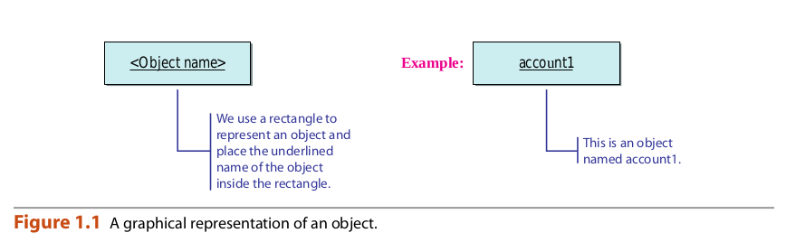
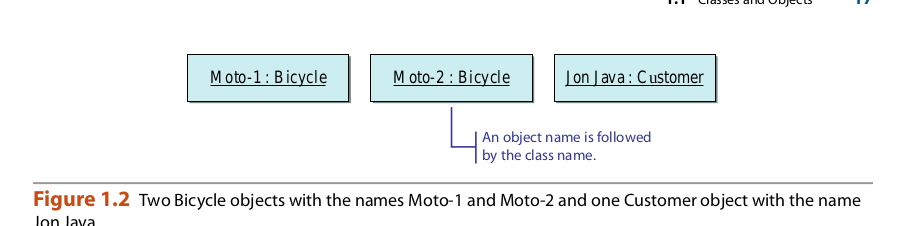
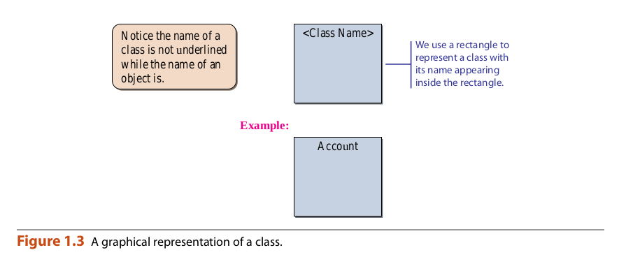

## Classes and objects

Los dos conceptos más importantes en la programación orientada a objetos son la clase.
y el objeto. En el término más amplio, un objeto es una cosa, tanto tangible como intangible.
ble, eso podemos imaginar. Un programa escrito en estilo orientado a objetos consistirá
de objetos que interactúan. Para un programa para realizar un seguimiento de los estudiantes residentes de una universidad
dormitorio, podemos tener muchos objetos de Estudiante, Habitación y Piso. Para otro pro-
Para hacer un seguimiento de los clientes y el inventario de una tienda de bicicletas, es posible que tengamos
Cliente, Bicicleta, y muchos otros tipos de objetos. Un objeto se compone de datos
y operaciones que manipulan estos datos. Por ejemplo, un objeto de estudiante puede con-
datos tales como nombre, sexo, fecha de nacimiento, domicilio, número de teléfono y edad
y operaciones para asignar y cambiar estos valores de datos. Usaremos la nota-
Se muestra la figura 1.1 en todo el libro para representar un objeto. La notación
que usamos en el libro se basa en la notación estándar de la industria llamada UML, que
significa Unified Modeling Language. En algunas de las ilustraciones, relajamos el
Reglas de UML ligeramente para la pedagogía.

Casi todos los programas no triviales tendrán muchos objetos del mismo tipo.
Por ejemplo, en el programa de la tienda de bicicletas esperamos ver muchas bicicletas y otros
objetos. La figura 1.2 muestra dos objetos de bicicletas con los nombres Moto-1 y Moto-2
y un objeto de cliente con el nombre Jon Java.

Figure 1.1 A graphical representation of an object.

Figure 1.2 Two Bicycle objects with the names Moto-1 and Moto-2 and one Customer object with the name
Jon Java.

Dentro de un programa escribimos instrucciones para crear objetos. Para que la computadora
Para poder crear un objeto, debemos proporcionar una definición, llamada clase. Una clase es una
tipo de molde o plantilla que dicta lo que los objetos pueden y no pueden hacer. Un objeto
Se llama una instancia de una clase. Un objeto es una instancia de exactamente una clase. Un
instancia de una clase pertenece a la clase. Los dos objetos de bicicletas Moto-1 y Moto-2.
Son ejemplos de la clase de bicicletas. Una vez que se define una clase, podemos crear tantos
Instancias de la clase como un programa requiere.

#### Things to remember
Se debe definir una clase antes de poder crear una instancia (objeto) de la clase.

La Figura 1.3 muestra un diagrama que usaremos a lo largo del libro para representar
una clase.

Muchos programadores principiantes pueden no ver la distinción entre la clase y el objeto como
Claramente como lo hacen los programadores más experimentados. Puede ser útil comparar la clase y
Objeto a un grabado en madera y las impresiones producidas a partir del grabado en madera. Un grabado en madera es un bloque de
Grabado en madera con un diseño para impresión. Una vez que tienes un grabado en madera, puedes hacer tantos
Imprime como quieras. De manera similar, una vez que tenga una clase, puede hacer tantos objetos desde el
clase. Además, al igual que no puede hacer impresiones sin tener un grabado en madera, no puede crear un
Objeto sin definir primero una clase. Para impresiones de muestra del artista japonés del siglo XIX.
Hiroshige.

