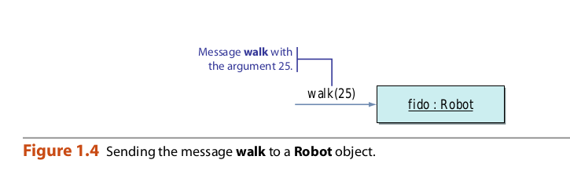
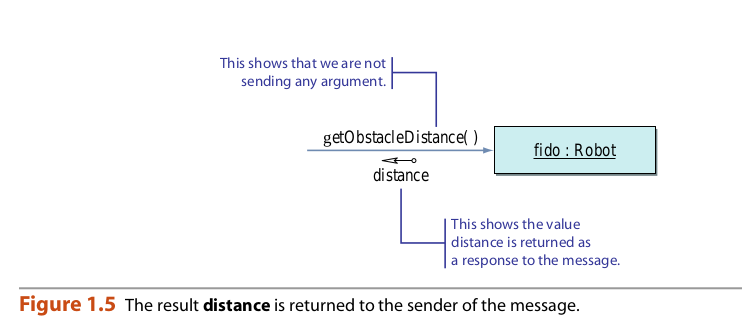
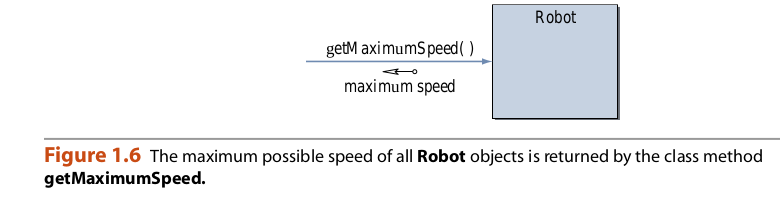

## Messages and Methods.

Al escribir programas orientados a objetos, primero debemos definir las clases, y mientras
gramo se está ejecutando, utilizamos las clases y los objetos de estas clases para lograr
Tareas. Una tarea puede ir desde sumar dos números hasta calcular un pago de intereses.
para un préstamo universitario, para calcular el ángulo de reingreso
de un transbordador espacial. Para instruir a un
Clase o un objeto para realizar una tarea, le enviamos un mensaje. Por ejemplo, enviamos
un mensaje de depósito a un objeto de Cuenta para depositar $ 100.

Para que una clase o un objeto procese el mensaje, se debe programar de acuerdo con
cordingly No puedes simplemente enviar un mensaje a cualquier clase u objeto. Puede enviar un
mensaje solo a las clases y objetos que entienden el mensaje que envías. por
una clase o un objeto para procesar el mensaje que recibe, debe poseer una correspondencia
método, que es una secuencia de instrucciones que una clase o un objeto sigue para
realizar una tarea. Un método definido para una clase se llama método de clase y método
definido para un objeto es un método de instancia.

Veamos primero un ejemplo de un método de instancia. Supongamos un método llamado
caminar se define para un objeto de robot e instruye al robot para que camine en una zona designada
tancia Con este método definido, podemos enviar el mensaje a un objeto Robot,
Junto con la distancia a recorrer. Un valor que pasamos a un objeto se llama
argumento de un mensaje. Observe que el nombre del mensaje que enviamos a un objeto o
una clase debe ser igual al nombre del método. En la Figura 1.4 representamos el envío
ing de un mensaje.

El diagrama en la Figura 1.4 ilustra la comunicación unidireccional; es decir, un
El objeto realiza la operación solicitada (recorre la distancia designada) pero
No responde al remitente del mensaje. En muchas situaciones, necesitamos una respuesta en
a lo que responde un objeto devolviendo un valor al remitente del mensaje.
Por ejemplo, supongamos que queremos saber la distancia desde un robot hasta su obstáculo más cercano.
El diseñador de un robot puede incluir un método getObstacleDistance que devuelve
el valor deseado. El diagrama en la Figura 1.5 muestra un método que devuelve un valor
al remitente del mensaje. En lugar de devolver un valor numérico, un método puede
Puerto de vuelta el estado de la operación solicitada. Por ejemplo, un método de caminar puede
ser definido para devolver el estado de éxito / falla para indicar si el especificado
la distancia se cubrió con éxito o no (por ejemplo, falla cuando el robot se topa con
un obstaculo).

Ahora veamos un ejemplo de métodos de clase. El método de clase getMaxi-
mumSpeed ​​que se muestra en la Figura 1.6 devuelve la velocidad máxima posible de todos los robots
objetos. Un método como getMaximumSpeed ​​que trata con información colectiva
Acerca de las instancias de una clase por lo general se define como un método de clase. Así definimos una
Método de instancia para una tarea que pertenece a una instancia individual y un método de clase
para una tarea que pertenece a todas las instancias.

