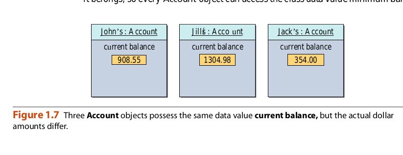
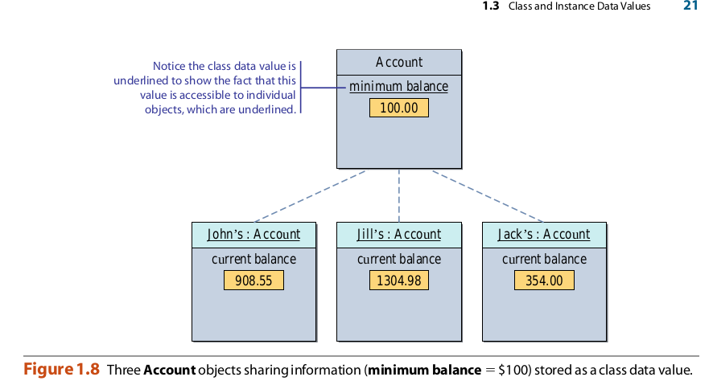
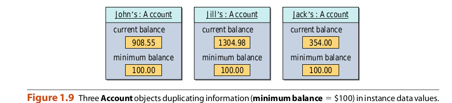
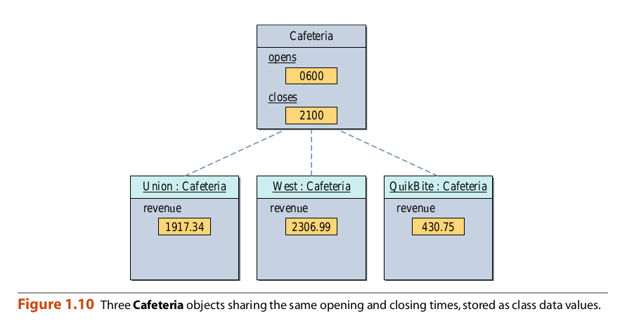
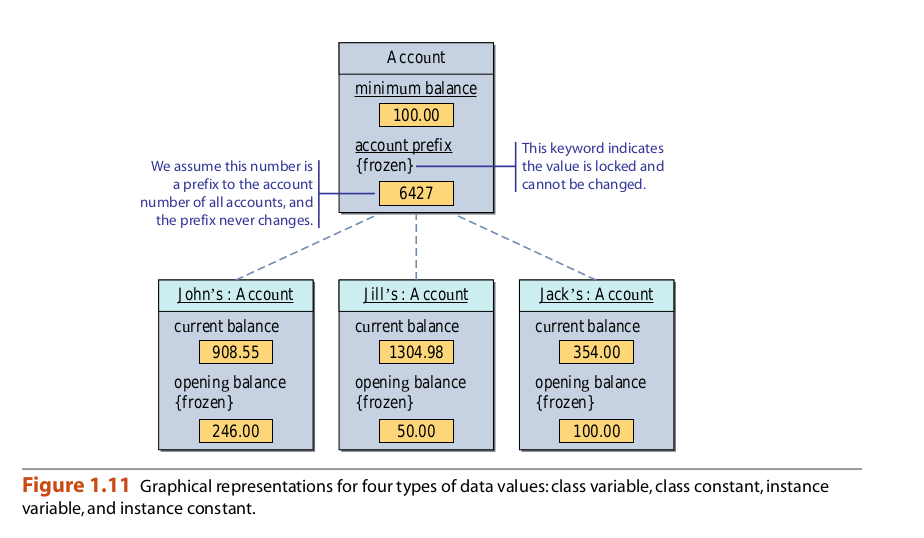

## Class and Instance Data Values

Supongamos que el método de depósito de un objeto de cuenta indica al objeto que agregue un determinado
ascender al saldo actual. ¿Dónde guarda el objeto el saldo actual?
Recuerde que un objeto se compone de valores y métodos de datos. Análogo a
Al definir los métodos de clase e instancia, podemos definir los valores de datos de clase e instancia.
Por ejemplo, definimos un saldo actual de valor de datos de instancia para objetos de Cuenta
para registrar el saldo actual. La figura 1.7 muestra tres objetos de cuenta con sus
Datos de datos del saldo actual. Observe que todos tienen el mismo valor de datos actual
equilibrio Todas las instancias de la misma clase poseerán el mismo conjunto de valores de datos. los
las cantidades reales en dólares para el saldo actual, como lo ilustra el diagrama, difieren de uno
instancia a otro. Elementos como el saldo de apertura y el número de cuenta son otros
valores de datos de instancia posibles para objetos de cuenta.

Un valor de datos de clase se utiliza para representar información compartida por todas las instancias o para
Representar información colectiva sobre las instancias. Por ejemplo, si cada cuenta
debe mantener un saldo mínimo de, por ejemplo, $ 100, podemos definir un valor de datos de clase
balance minimo . Una instancia puede acceder a los valores de datos de clase de la clase a la que
pertenece, por lo que cada objeto de Cuenta puede acceder al saldo mínimo del valor de datos de clase.

La figura 1.8 muestra cómo representamos un valor de datos de clase. Tenga en cuenta que subrayamos la
valor de datos de clase. Debido a que los objetos de una clase están subrayados, y los datos de clase
Los ues son accesibles a todos los objetos de la clase, también subrayamos los datos de la clase
Valor para mostrar esta relación. Los valores de datos también se llaman miembros de datos porque
pertenecen a una clase o instancia de la clase.

Para apreciar la importancia de un valor de datos de clase, veamos qué sucede si
Representamos el saldo mínimo como un valor de datos de instancia. La figura 1.9 muestra tres
Los objetos de cuenta que tienen diferentes importes en dólares para el saldo actual, pero
mismo monto en dólares para el saldo mínimo. Obviamente, esta duplicación de mini-
El balance de la mamá es redundante y desperdicia espacio. Considera, por ejemplo, lo que sucede.
Si el banco eleva el saldo mínimo a $ 200. Si hay 100 objetos de cuenta,
entonces todas las 100 copias del saldo mínimo deben ser actualizadas. Podemos evitar esto por
definiendo balance mínimo como un valor de datos de clase. La figura 1.10 muestra otro examen.
Por ejemplo, los horarios de apertura y cierre son compartidos por todas las cafeterías en el campus.

El cambio es una constante. La Figura 1.11 ilustra cómo representamos y distinguimos
Entre las variables y constantes. Usamos la palabra clave congelada para que constantes indiquen
que no pueden cambiar Observe que ahora tenemos cuatro tipos de valores de datos: clase
variables, constantes de clase, variables de instancia y constantes de instancia.

