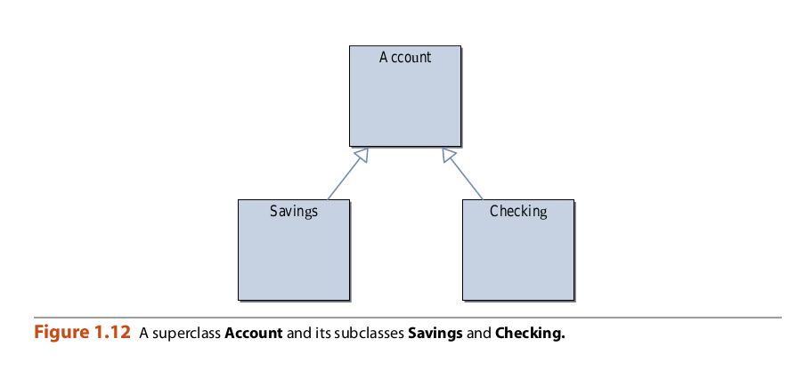
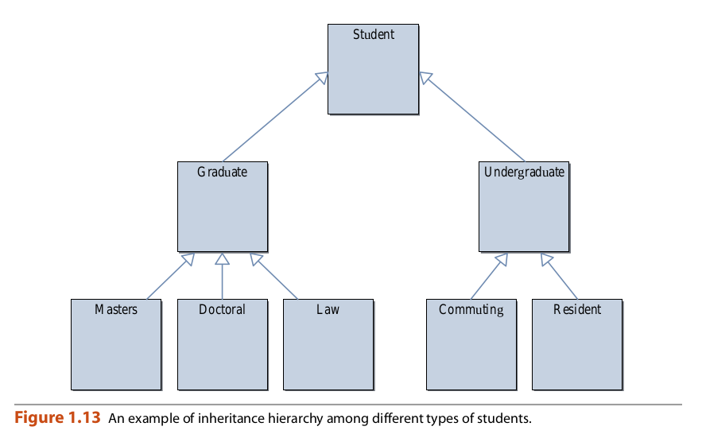

## Inheritance

Cuando usamos la clase Cuenta y sus instancias para ilustrar conceptos orientados a objetos
cepts, algunos de ustedes probablemente estaban pensando en cuentas corrientes, mientras que otros
Puede haber estado pensando en cuentas de ahorro. No distinguimos entre los
dos en los ejemplos Pero cuando miramos el problema un poco más cuidadosamente,
se darán cuenta de que, de hecho, estos dos tipos de cuentas son diferentes, aunque
Comparte muchas características.

En general, usar solo una clase para modelar dos o más entidades que son
Similar pero diferente no es un buen diseño. En la programación orientada a objetos, utilizamos un
mecanismo llamado herencia para diseñar dos o más entidades que son diferentes pero
comparte muchas características comunes. Primero definimos una clase que contiene las características comunes
Turas de las entidades. Luego definimos las clases como una extensión de la clase común.
Heredando todo de la clase común. A la clase común la llamamos
Superclase y todas las clases que heredan de ella las subclases. También llamamos a la superclase.
un ancestro y la subclase un descendiente. Otros nombres para superclase y subclase.
son clase base y clase derivada, respectivamente. Para el ejemplo del banco, podemos definir
una cuenta de superclase y luego defina Ahorros y cuentas corrientes como subclases de
Cuenta Representamos la superclase y sus subclases como se muestra en la Figura 1.12.
Observe que dibujamos flechas de cada subclase a su superclase porque una subclase
Puede referirse a elementos definidos en su superclase, pero no al revés.

La herencia no se limita a un nivel. Una subclase puede ser una superclase de otra
Clases, formando una jerarquía de herencia. Considere el ejemplo que se muestra en la Figura 1.13.

La herencia es muy poderosa, y si se usa adecuadamente, podemos desarrollar complejos
Programas muy eficientes y elegantes. La otra cara de usar una herramienta muy poderosa.
es que si no lo usamos correctamente, podríamos terminar en una situación mucho peor que si
No lo usamos. Estaremos viendo muchos ejemplos de herencia a lo largo de este
libro. En el Capítulo 2, por ejemplo, presentaremos muchas clases que vienen con el
Sistema java La mayoría de estas clases se definen mediante herencia. Proporcionaremos un
discusión en profundidad sobre la herencia y temas relacionados en el Capítulo 13.

